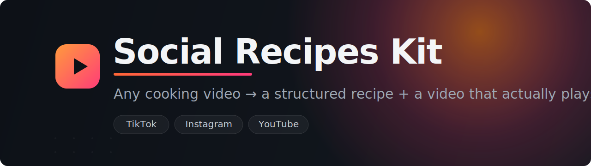

<div align="center">



<br/>

[](LICENSE)
[](packages/recipe-extractor)
[](packages/recipe-video-player)
[](#how-it-actually-works)
[](#)

<h3>Turn any TikTok / Instagram / YouTube cooking video into a <em>structured recipe</em> — plus a copy of the video that <em>actually plays</em> in your own app.</h3>

It even works on videos with no caption and no subtitles, because it <strong>watches</strong> the video instead of reading the text.

</div>

---

This is real, battle-tested code pulled out of a live app. **You don't have to
use all of it** — it's three independent pieces. Take one, two, or all three.

| | What it does | Language | You need | Works alone? |
|---|---|---|---|---|
| 🥄 **Extract** | video link → recipe data (ingredients, steps, quantities) + the saved video | Python | 1 AI API key | ✅ |
| ▶️ **Player** | a React component that plays the saved video natively | React / TS | a React app | ✅ |
| 📩 **Instagram** | people share a reel into your DMs → auto-extracted | Python | a Meta app | builds on Extract |

> **Using Claude Code?** Open this repo and say *"set up the Extract part of
> Social Recipes Kit for me."* Everything here is written so your agent can
> follow it. The steps below are the same ones it'll do.

---

## 🥄 Part 1 — Get a recipe out of a video

Give it a video link (TikTok, Instagram reel, YouTube, …) and get back the recipe
as structured data — title, ingredients with quantities, step-by-step directions
— *and* a downloaded copy of the video so you can show it later. **This is the
core; most people want at least this.** The code is Python, but you can run it as
a tiny web service and call it from an app in **any** language.

### Start here (the 5-minute version)

You do exactly **two** manual things: install one program, and get one key.

**1. Install ffmpeg** — the only thing pip can't install for you (it's the tool
that reads the video):

| OS | Command |
|---|---|
| macOS | `brew install ffmpeg` |
| Ubuntu / Debian | `sudo apt install ffmpeg` |
| Windows | `winget install ffmpeg` *(or [download](https://ffmpeg.org/download.html))* |

**2. Get an AI API key** — go to <https://openrouter.ai/keys>, sign in, create a
key (starts with `sk-or-`). One key, lots of models; you can swap in OpenAI or
others later.

**3. Install and run:**

```bash
cd packages/recipe-extractor
pip install -e .

export OPENROUTER_API_KEY=sk-or-...        # paste your real key

recipe-extractor "https://www.tiktok.com/@user/video/123"
```

You'll see the recipe printed and the video saved into `recipe_output/`. Done.

### Call it from your own app

Run it as a tiny web service instead:

```bash
pip install -e ".[service]"
recipe-extractor-serve            # http://127.0.0.1:8000
```

```
POST /extract     {"url": "..."}      →  recipe as JSON
GET  /videos/<id>.mp4                  →  the playable video
```

Full options (changing the AI model, your own storage, etc.):
**[recipe-extractor README →](packages/recipe-extractor/README.md)**

---

## ▶️ Part 2 — Play the saved video in a React app

Embedding TikTok/Instagram directly is unreliable — videos won't autoplay, or the
*wrong* clip shows up. This component plays the saved copy from Part 1 smoothly,
and falls back to the platform embed only when it has to.

```bash
npm install recipe-video-player
```

```tsx
import { RecipeVideoPlayer } from 'recipe-video-player';

<RecipeVideoPlayer
  source="TikTok"
  sourceUrl={recipe.source_url}
  sourceId={recipe.source_id}
  videoUrl={`${API}/videos/${recipe.id}.mp4`}   // the saved video from Part 1
  posterUrl={posterUrl}
/>
```

Details & styling: **[recipe-video-player README →](packages/recipe-video-player/README.md)**

---

## 📩 Part 3 — Let people send you a reel on Instagram

Connect to Instagram so that when someone **shares a reel into your DMs**, it
runs Part 1 automatically and (optionally) replies. No copy-pasting links.

```python
from fastapi import FastAPI
from recipe_extractor import make_router

app = FastAPI()

def on_reel(sender_id, result):
    save_to_my_db(sender_id, result)              # your storage
    return f"Saved {result['recipe']['title']} ✅"  # DM'd back to the sender

app.include_router(make_router(on_reel=on_reel))   # GET/POST /instagram/webhook
```

**This part is optional and off by default** — Parts 1 & 2 work without it. It
needs a Meta developer app and some one-time dashboard setup, all written out
step by step: **[INSTAGRAM_SETUP.md →](INSTAGRAM_SETUP.md)**

---

## How it actually works

You don't need this to use the kit — but here's why it's good.

#### 🎞️ It reads the video, not the caption
Most scrapers read the text description. Half of cooking videos have a useless
caption and no subtitles. So this *watches* the video: `ffmpeg` grabs the frames
at the visually important moments (the cut where the tray comes out of the oven,
the on-screen ingredient list, the final plated dish), and an AI vision model
reads the cooking from those frames. Each ingredient comes back cleanly split
into a plain name (`tomato`), a prep note (`diced`), and a gram estimate.

#### 📼 It saves the video so it actually plays
iPhones block autoplay, TikTok sometimes shows a *random* clip instead of the one
you wanted, Instagram forces a tap-through. So the kit downloads the video once
and serves it from your side, and the player just plays a normal video file —
which works everywhere.

#### 🔓 The Instagram "share a reel" trick
When someone shares a reel into your DMs, Instagram does **not** hand you a normal
link. Turning that DM into a downloadable video took real work — two non-obvious
findings make it possible, both baked into
[`instagram_cdn.py`](packages/recipe-extractor/src/recipe_extractor/instagram_cdn.py)
and [`instagram_webhook.py`](packages/recipe-extractor/src/recipe_extractor/instagram_webhook.py).
The whole connection — verification, security check, finding the reel, replying —
is turnkey via one function, `make_router`.

---

## What's in the box

```
social-recipes-kit/
├── packages/
│   ├── recipe-extractor/      Part 1 + Part 3  (Python)
│   └── recipe-video-player/   Part 2           (React / TypeScript)
├── examples/extract_one.py    a tiny runnable demo
├── INSTAGRAM_SETUP.md         step-by-step Meta setup for Part 3
└── README.md                  you are here
```

## License

[MIT](LICENSE) — use it however you like.
